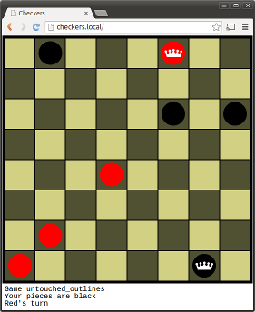

# Checkers HTML Cient

A browser-based client for spectating or playing the network multiplayer game
[checkers](https://github.com/batkinson/checkers) implemented using html, 
nodejs and socket.io.



## Requirements

To run this program, you'll need:

  * NPM
  * NodeJS

You will also need to have a checkers server running on the local host on 
port 5000.

## Setup

To run the program, you just need to install the dependencies. This should be
as simple as running the following from the project directory:

```
npm install
```

## Running

Starting the nodejs server is as simple as running:

```
nodejs server
```

Once the game server is started you can play games by pointing a browser at:

http://localhost:3000/

You can spectate games by pointing your browser at:

http://localhost:3000/spectate

